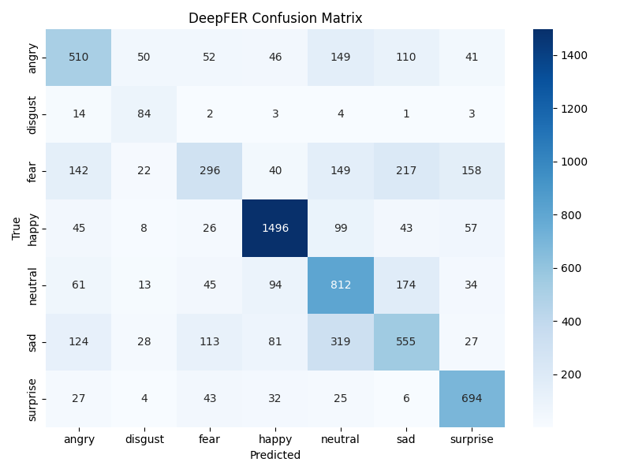

# DeepFER Model Evaluation Report

**Test Accuracy:** 0.6195

## Per-Class Metrics

| Class | Precision | Recall | F1-score |
|---|---|---|---|
| angry | 0.55 | 0.53 | 0.54 |
| disgust | 0.40 | 0.76 | 0.53 |
| fear | 0.51 | 0.29 | 0.37 |
| happy | 0.83 | 0.84 | 0.84 |
| neutral | 0.52 | 0.66 | 0.58 |
| sad | 0.50 | 0.45 | 0.47 |
| surprise | 0.68 | 0.84 | 0.75 |

